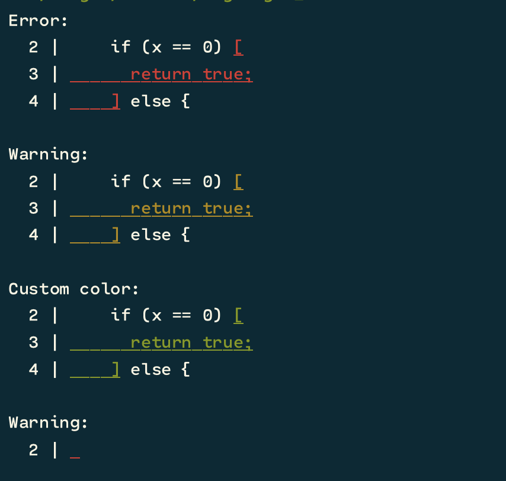

<samp>

Rust util that highlights an error.

Example

The code below:

```rust
let code = "functon is_zero (x) {
  if (x == 0) [
    return true;
  ] else {
    return false;
  }
}";
println!("Error:");
println!("{}", code_highlighter::highlight_error(38, 64, &code));
println!("");

println!("Warning:");
println!("{}", code_highlighter::highlight_warning(38, 64, &code));
println!("");

println!("Custom color:");
println!("{}", code_highlighter::highlight(38, 64, &code, "\x1b[4m\x1b[32m"));
println!("");

let code = "(Foo x) = 7[0 ]\n";
println!("Error:");
println!("{}", code_highlighter::highlight_error(16, 17, &code));
println!("");
```

Will output:



A fork of [highlight_error](https://github.com/VictorTaelin/rust_highlight_error) 🥺
